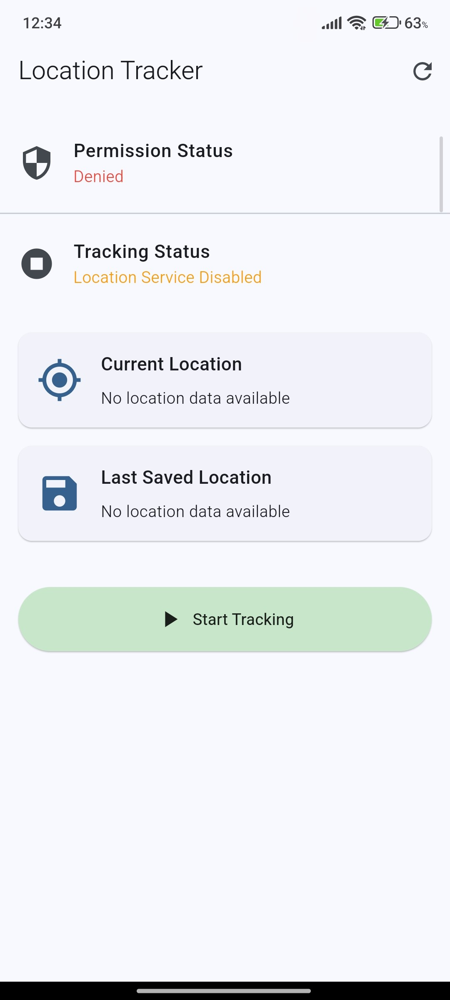
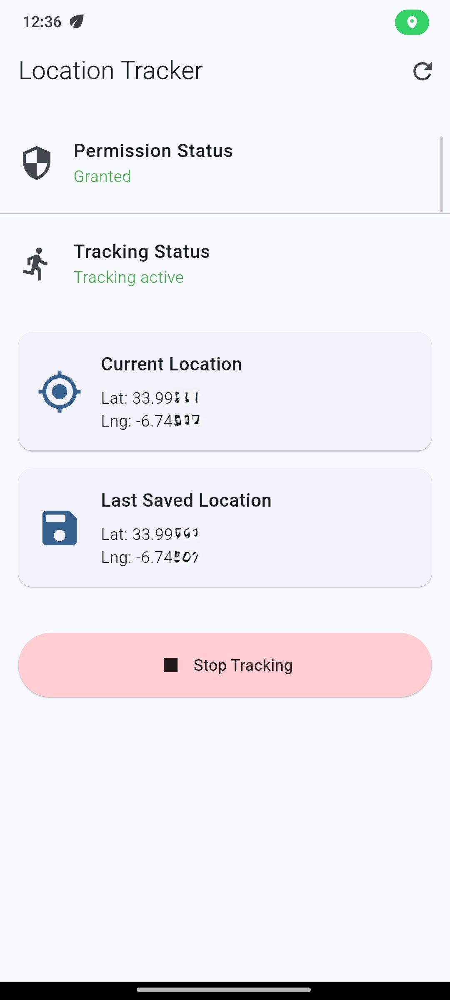
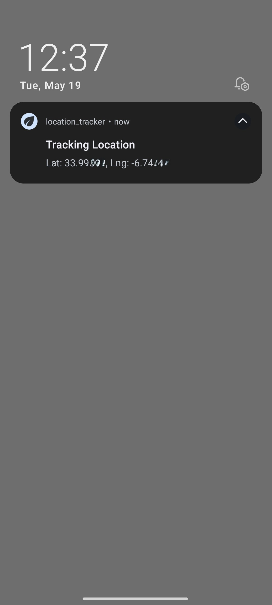

# Flutter Location Tracking Assignment

This project is a Flutter application built for a technical assignment. It demonstrates foreground and background location tracking, permission handling, local persistence, and a clean Riverpod-based architecture.

The goal was to keep the implementation practical, readable, and aligned with modern Flutter best practices.

---

## What’s included

- Foreground and background location tracking  
- Permission handling for Android and iOS, including denied and permanently denied states  
- Local persistence of the latest tracked location across app restarts  
- Logging of mocked/spoofed GPS locations for debugging purposes
- Real-time UI updates for tracking status and location changes  
- Background service support with persistent notification on Android  
- Lifecycle awareness to react to permission changes when returning from system settings  

---

## Screenshots

### Main Screen

<p align="center">
  
</p>

### Tracking Active

<p align="center">
  
</p>

### Persistent Notification

<p align="center">
  
</p>

---

## Tech stack

- **Flutter**  

- **Riverpod 2.6.1**  
  Used for clean and predictable state management.  
  (using plain `NotifierProvider` / `AsyncNotifierProvider` without code generation)  
  Chosen because it keeps logic separated and avoids boilerplate.

- **Geolocator**  
  Used to access accurate device location with good platform support.

- **Flutter Background Service**  
  Used to keep location tracking running in the background on Android.

- **Flutter Local Notifications**  
  Used to display a persistent notification during background tracking.

- **Shared Preferences**  
  Used to store the last known location locally in a simple way.

- **Permission Handler**  
  Used to manage runtime permissions cleanly on both Android and iOS.

---

## Project structure

The app is split into clear layers to keep responsibilities separated and easy to follow:

- `lib/services/`  
  Location, permissions, notifications, storage, and background execution

- `lib/providers/`  
  Riverpod state management

- `lib/screens/` & `lib/widgets/`  
  UI components built with standard Material widgets

---

## Running the project

Clone the repository and install dependencies:

```bash
flutter clean
flutter pub get
```

Run on a device or simulator:

```bash
flutter run
```

A physical device is recommended for full background tracking tests.

---


## Platform Notes

### Android

Uses a Foreground Service with a persistent notification to provide continuous background location updates. Compatible with Android 14+ foreground service requirements (`FOREGROUND_SERVICE_LOCATION`, `POST_NOTIFICATIONS`).

### iOS

Uses `UIBackgroundModes` (`location`, `fetch`) to support background location tracking while permitted by the system. 

iOS manages background execution aggressively to preserve battery life. If the user explicitly force-quits the app from the app switcher, continuous tracking is not guaranteed and relaunch behavior depends on system-managed location events (such as significant location changes). This is an OS-level platform limitation.

---

## Testing

You can verify the assignment requirements by testing:

- Permission flow (grant, deny, permanently deny)  
- Background tracking (send app to background while tracking is active)  
- Persistence (restart app and verify last saved location is restored)  
- Location updates (use real device movement or emulator mock location)  

---

Built with a focus on clean architecture, platform-aware implementation, and practical Flutter engineering.